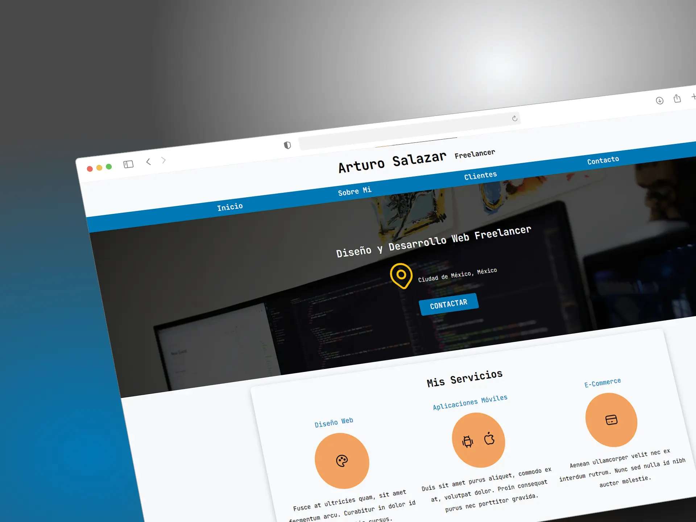
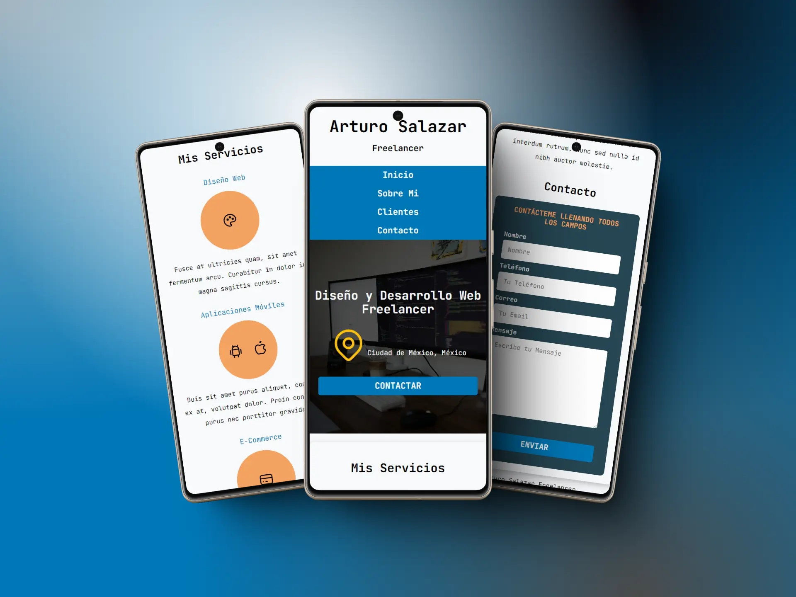

# 🧑‍💻 Freelancer Template 🌟

Este template de **sitio web para freelancers**, hecho completamente en **HTML** y **CSS**. La estructura es simple pero efectiva, ideal para crear una presencia profesional en línea.

## ✨ Características

- **Diseño Responsive** 📱💻: Se adapta perfectamente a dispositivos móviles y de escritorio.
- **Hecho con HTML y CSS** 🎨: Totalmente construido con HTML y CSS, sin JavaScript.
- **Normalize.css** 🧹: Utiliza la hoja de estilos `normalize.css` para garantizar un comportamiento consistente en todos los navegadores.
- **Preload para un mejor rendimiento** ⚡: Se utilizó la técnica de preload para las hojas de estilo, optimizando la carga y mejorando el rendimiento de la página.

## 📸 Vista Previa

Aquí te dejo un vistazo del diseño del template:

### Imagen 1

 

### Imagen 2

## 🔧 Personalización

Puedes personalizar fácilmente este template:
- Cambia los textos e imágenes para adaptarlo a tu perfil.
- Añade más secciones o ajusta los estilos en el archivo `styles.css`.